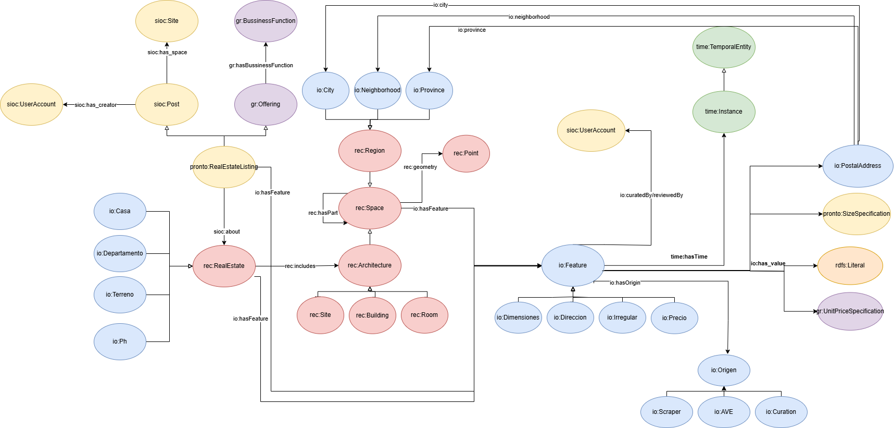

# Inmontology
Inmontology es una ontología que permite describir elementos del dominio inmobiliario, sus atributos y sus relaciones. El objetivo es proporcionar una estructura para datos provenientes de avisos inmobiliarios, considerando los inmuebles y sus características intrínsecas, los avisos inmobiliarios que publican esos inmuebles, y los agentes involucrados en la publicación de la oferta. En particular, la ontología permite almacenar los diversos valores que las características de un aviso o inmueble toman a lo largo del tiempo, así como también permite conocer su origen. Esto tiene sentido en el contexto que ciertos datos se pueden recuperar inicialmente a partir de los avisos inmobiliarios pero otros datos están embebidos en los textos del aviso, y se pueden extraer utilizando técnicas de extracción de información (AVE – Attribute-Value Extractor). En algunos casos puede haber ambigüedad en los valores de una misma característica, por lo que una persona puede realizar un curado manual para determinar el valor real de esa característica.
La siguiente imagen representa un resumen de algunas de las características más representativas de la ontología.




Notar que existen otras subclases de RealEstate y Feature, y se mencionan algunas a modo de ejemplo.
Si bien la ontología no restringe el uso del rango de valores de cada característica, sería deseable aplicar un SHACL para asegurarse que sean usadas de la manera esperada. Esto es, para la característica dirección (AddressFeature), los valores asociados deberían ser instancias de PostalAddress, y no por ejemplo de PriceSpecification.
Algunas características son propias del aviso (el Precio por ejemplo). Otras son del inmueble (como la Dirección), y otras describen alguna parte en particular de un inmueble (por ejemplo, describen el Terreno las Dimensiones de un inmueble, saber si es Irregular o no, si está en una esquina)


Por ejemplo, a continuación se ejemplifica un anuncio de un terreno en venta que tiene un precio de 28000 USD obtenido a partir del scraper. Además, el terreno que oferta tiene una caracteristica dirección que es "El Tejado" obtenida a partir del scraper, y otra dirección "LOTE 09;LOTE 10;LOTE 11;LOTE 12;LOTE 13" obtenida a partir del ave.

```
:listing_site2_A1339771297 a pronto:RealEstateListing ;
    rdfs:label "Lotes, El Tejado, En Block O Separados"^^xsd:string ;
    dc:date "2023-02-08T00:00:00"^^xsd:dateTime ;
    gr:hasBusinessFunction gr:Sell ;
    sioc:about :real_estate_site2_A1339771297 ;
    sioc:has_creator :account_site2_133807924 ;
    sioc:has_space pronto:site2 ;
    sioc:id "A1339771297"^^xsd:string ;
    sioc:read_at "2024-02-02T00:00:00"^^xsd:dateTime ;
    :hasFeature :feature_price_1_listing_site2_A1339771297 ;
    foaf:maker :agent_IBARRA%20PAFUNDI%20Propiedades .

:real_estate_site2_A1339771297 a :Terreno ;
    :hasFeature :feature_address_1_real_estate_site2_A1339771297,
        :feature_address_2_real_estate_site2_A1339771297,
        :feature_es_multioferta_1_real_estate_site2_A1339771297 ;
    rec:includes :space_building_site2_A1339771297,
        :space_land_site2_A1339771297 .

:feature_price_1_listing_site2_A1339771297 a :Precio ;
    :hasOrigin :Scraper ;
    :hasValue [ a gr:UnitPriceSpecification ;
            gr:hasCurrency "USD"^^xsd:string ;
            gr:hasCurrencyValue "28000.0"^^xsd:float ;
            gr:priceType "BASE"^^xsd:string ] ;
    time:hasTime [ a time:Instant ;
            time:inXSDDateTimeStamp "2024-02-02T00:00:00"^^xsd:dateTime ] .

:feature_address_1_real_estate_site2_A1339771297 a :Direccion ;
    :hasOrigin :Scraper ;
    :hasValue [ a :PostalAddress ;
            :address "El Tejado"^^xsd:string ;
            :city :district_Mar_del_Plata_Bs.As._Costa_Atl%C3%A1ntica ;
            :neighborhood :neiborhood_province_Bs.As._Costa_Atl%25C3%25A1ntica_district_Mar_del_Plata_Bs.As._Costa_Atl%25C3%25A1ntica_None ;
            :province :province_Bs.As._Costa_Atl%C3%A1ntica ] ;
    time:hasTime [ a time:Instant ;
            time:inXSDDateTimeStamp "2024-02-02T00:00:00"^^xsd:dateTime ] .

:feature_address_2_real_estate_site2_A1339771297 a :Direccion ;
    :hasOrigin :AVE ;
    :hasValue [ a :PostalAddress ;
            :address "LOTE 09;LOTE 10;LOTE 11;LOTE 12;LOTE 13"^^xsd:string ;
            :city :district_Mar_del_Plata_Bs.As._Costa_Atl%C3%A1ntica ;
            :neighborhood :neiborhood_province_Bs.As._Costa_Atl%25C3%25A1ntica_district_Mar_del_Plata_Bs.As._Costa_Atl%25C3%25A1ntica_None ;
            :province :province_Bs.As._Costa_Atl%C3%A1ntica ] ;
    time:hasTime [ a time:Instant ;
            time:inXSDDateTimeStamp "2024-01-15T00:00:00"^^xsd:dateTime ] .

```